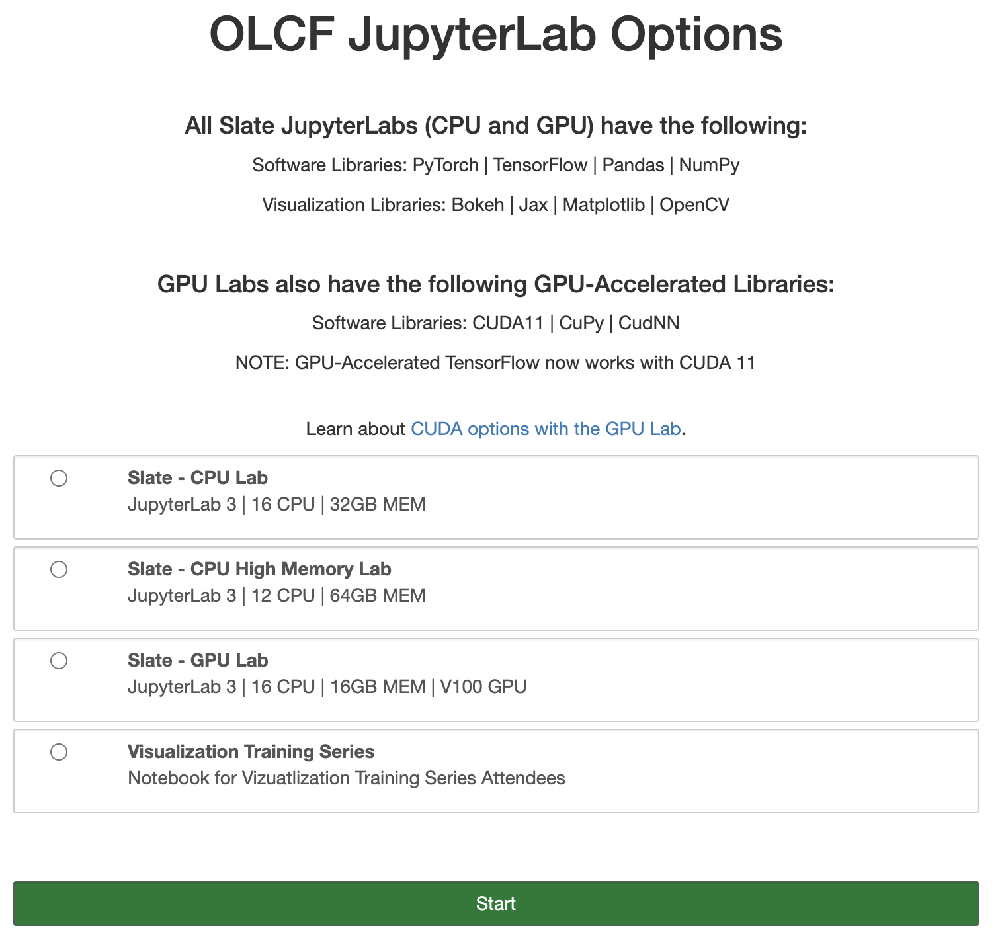

Summit (OLCF)
******************

`Summit <https://www.olcf.ornl.gov/summit/>`_ (or OLCF-4) is an IBM AC922 supercomputer located at Oak Ridge Leadership Computing Facility (OLCF). Launched in mid-2018, it is a 200 PFLOP system consisting of 4,608 nodes linked with EDR Infiniband. Each compute node contains 2x IBM POWER9 sockets and 6x NVIDIA V100 GPUs linked with NVLINK. It currently occupies spot 4 on the latest `Top500 <https://www.top500.org/system/179397/>`_ list (June 2022).

We hope to add a DeepHyper tutorial on OLCF Frontier in future iterations of this repository. 

Aside: POWER9 CPUs
======================

A distinguishing feature of the Summit CPUs is their use of a reduced instruction set computer (RISC) instruction set architecture versus the complex CISC x86 ISA that dominates HPC (e.g. the AMD CPUs on ThetaGPU and Perlmutter). One downside to this choice is that many library dependencies that have widely-available precompiled binaries for x86 do not offer precompiled binaries for POWER9, e.g. on the default Anaconda channels.

To ameliorate these pains, IBM, Summit's main vendor and leader of the OpenPOWER Foundation, maintained the"Watson Machine Learning Community Edition" (WML-CE) Anaconda channel for several years, which contained binaries for TensorFlow, PyTorch, and many other libraries. In 2019, the Power ISA was open-sourced and the OpenPOWER Foundation became a subsidiary of the Linux Foundation. 

In 2021, the Open Cognitive Environment Community Edition (Open-CE) effectively replaced WML-CE on `Summit <https://docs.olcf.ornl.gov/software/analytics/ibm-wml-ce.html>`_ and in the broader POWER9 `user community <https://community.ibm.com/community/user/hybriddatamanagement/blogs/christopher-sullivan/2021/06/16/open-cognitive-environment-open-ce-a-valuable-tool>`_. We will use the Open-CE modules on Summit as the basis for our DeepHyper installation.

Connect to Summit
=====================

For detailed instructions for connecting to OLCF resources for the first time, consult the `documentation <https://docs.olcf.ornl.gov/connecting/index.html#connecting-to-olcf>`_. A SecurID fob is required, and SSH multiplexing is disabled. From a terminal:

.. code-block:: console

    $ ssh <username>@summit.olcf.ornl.gov

DeepHyper Installation
======================

It is recommended to create the custom environments in the “Project Home” directory (``/ccs/proj/<project_id>/<user_id>``. This storage space works better with compute nodes, in general.

After logging in Summit, use the `installation script <https://github.com/deephyper/anl-22-summer-workshop/blob/main/scripts/OLCF-Summit/dh_install.sh>`_ provided to install DeepHyper and the associated dependencies. Download the file and run ``source dh_install.sh`` on the terminal. 

Unlike ThetaGPU, the Summit login nodes have GPUs attached to them. Build toolchains that depend on detecting the presence of a GPU and/or the matching CUDA libraries will work on the login nodes typically as well as they would on the compute nodes. We will therefore build DeepHyper on a login node. 

Lmod is the module system used on Summit. It is an extension of Environment Modules and can handle both Lua-based and Tcl-based modulefiles. The script first loads an Open-CE module, including cuDNN. 

.. code-block:: console

   $ module load open-ce/1.5.0-py38-0
   $ module list

As of July 2022, this should automatically load and return the following versions of Spectrum MPI, CUDA, etc:

.. code-block:: none

   Currently Loaded Modules:
     1) xl/16.1.1-10    4) darshan-runtime/3.3.0-lite   7) spectrum-mpi/10.4.0.3-20210112  10) cuda/11.0.3
     2) lsf-tools/2.0   5) xalt/1.2.1                   8) nsight-compute/2021.2.1         11) open-ce/1.5.2-py38-0
     3) hsi/5.0.2.p5    6) DefApps                      9) nsight-systems/2021.3.1.54

Next, we create a cloned conda environment and install DeepHyper. 

.. code-block:: console

   $ cd /ccs/proj/<project_id>/<user_id>
   $ conda create -p dh --clone open-ce-1.5.0-py38-0 -y
   $ conda activate /autofs/nccs-svm1_proj/<project_id>/<user_id>/dh

Because we have cloned the base environment in Open-CE, our environment already has TensorFlow 2.7.1, TF Probability 0.15.0, Horovod 0.23.0. 

However, we still need to install CUDA-aware `mpi4py` using the system's optimized MPI library:

.. code-block:: console

   $ module load gcc
   $ MPICC=mpicc pip install --force --no-cache-dir --no-binary=mpi4py mpi4py

Currently there is an issue with building ``mpi4py`` with the ``open-ce/1.5.2-py39-0`` module. 

Finally, we install DeepHyper:

.. code-block:: console

   $ pip install deephyper==0.4.2
   $ pip install matplotlib

Running the installed DeepHyper
===============================

Once DeepHyper is installed, one can use the DeepHyper after loading the modules and activating the user-cloned conda environment. For the LSTM example for SST data, first copy and paste the following scripts into the parent folder of the cloned conda environment on Summit:

* `load_modules.sh <https://github.com/nesar/DeepHyperSwing/blob/main/saul/load_modules.sh>`_
* `common.py <https://github.com/nesar/DeepHyperSwing/blob/main/saul/common.py>`_
* `evaluator_mpi.py <https://github.com/nesar/DeepHyperSwing/blob/main/saul/evaluator_mpi.py>`_
* `sst.py <https://github.com/nesar/DeepHyperSwing/blob/main/saul/sst.py>`_
* `job_submit.sh <https://github.com/nesar/DeepHyperSwing/blob/main/saul/job_submit.sh>`_
 
 
Using JupyterHub on Summit
====================================
There are two JupyterHub/JupyterLab sites for all OLCF users, depending on the level of security associated with the account and project:

* OLCF Moderate: https://jupyter.olcf.ornl.gov/
* OLCF Open: https://jupyter-open.olcf.ornl.gov/

GPU environments are only available within the OLCF Moderate JupyterHub. Each GPU kernel gets 16 CPU cores and a single NVIDIA V100, as indicated here:

Unfortunately, we cannot use the same user-customized cloned conda environment created above (to run the jobs on Summit) here within JupyterHub to perform DeepHyper analytics. We must clone a new conda environment, and register the environment as a Jupyter kernelspec with ``python -m ipykernel install --user --name yourenvname --display-name yourenvname``: 

   Conda environments created this way are only usable in JupyterLab. You can’t create an environment within JupyterLab and use these environments on other machines like Summit or Andes to run jobs. You will need to recreate the environment separately on those machines.

See 
`Jupyter at OLCF <https://docs.olcf.ornl.gov/services_and_applications/jupyter/overview.html#jupyter-at-olcf>`_ for more detailed information. 

 
